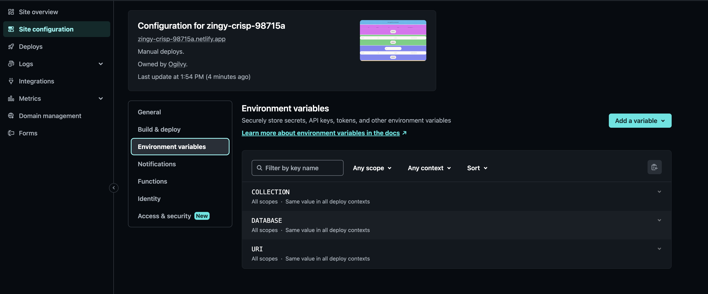

[](https://www.npmjs.com/)
[](https://nodejs.org/en/)
[](https://zh-hant.reactjs.org/)
[](https://www.typescriptlang.org/)
[](https://lesscss.org/)
[](https://lesscss.org/)
[](https://lesscss.org/)

<p align="center">
  <a href="https://github.com/jameshsu1125">
    
  </a>
  <h3 align="center">Logo</h3>
  <p align="center">
    Short description   
  </p>
</p>

## Table of contents

- [Table of contents](#table-of-contents)
- [Quick start](#quick-start)
- [Status](#status)
- [What's included](#whats-included)
- [Bugs and feature requests](#bugs-and-feature-requests)
- [naming conventions rules](#naming-conventions-rules)
- [Contributing](#contributing)
- [Creators](#creators)
- [Thanks](#thanks)
- [Copyright and license](#copyright-and-license)

## Quick start

- install module

```sh
$ npm i
```

- create `.env.local` file

```sh
touch src/pages/.env.local
```

- copy variables to `.env.local` file.

```text
URI=mongodb://localhost:27017/
DATABASE=demo
COLLECTION=test
```

- start project

```sh
$ npm run dev
```

- deploy on `netlify`

set environment variables same as `.env.local`.



deploy netlify functions.

```sh
$ npm run deploy
```

## Status

- Development since January 2023
- use [Netlify-cli](https://www.netlify.com/platform/core/cli/) for development environment and bundler.
- use [Express](https://expressjs.com/) for main router library.
- use [Typescript](https://www.typescriptlang.org/) for syntax.
- use [TailwindCSS](https://tailwindcss.com/) for css library.

## What's included

- `public` folder will copy to `/dist`
- `src` folder is reactJs entry point. default file is named as `app.tsx`

## Bugs and feature requests

- [Node](https://nodejs.org/en/) version must be above v18
- I will not maintain when this project is closed

## naming conventions rules

1. general variable - `Camel Case`
   > ex: _setState_、_currentTarget_、_pinkBackground_、_innerText_
2. react components and class name - `Pascal Case`.
   > ex: _RegularButton_、_NavigationBar_
3. global variable or state - `Pascal Case`.
   > ex: _Context_、_LandingState_
4. Immutable variable or environment variable - `Screaming Snake Case`.
   > ex: _PAGE_、<em>VITE_TITLE</em>
5. type - `I` = interface, `T` = type.
   > ex: _IProps_、_TResult_
6. enum options - `Pascal Case` + `"Type"`.
   > ex: _ActionType_、_AlertType_、_ModalType_
7. class name = `Snake Case`.
   > ex: _.button-group_、_.button-label_

[naming-conventions](https://medium.com/@code.ceeker/naming-conventions-camel-case-pascal-case-kebab-case-and-more-dc4e515b9652)

## Contributing

Please read through our [contributing guidelines](https://github.com/github/docs/blob/main/CONTRIBUTING.md). Included are directions for opening issues, coding standards, and notes on development.

Moreover, all HTML and CSS should conform to the [Code Guide](https://github.com/airbnb/javascript), maintained by [Main author](https://github.com/jameshsu1125).

## Creators

**maintainer, developer**

- [James Hsu](https://github.com/jameshsu1125)

## Thanks

Thank customers and some manufacturers for their support.

## Copyright and license

Code and documentation copyright 2011-2022 the authors. Code released under the [MIT License](https://reponame/blob/master/LICENSE).

<!-- open -n -a /Applications/Google\ Chrome.app/Contents/MacOS/Google\ Chrome --args --user-data-dir="/tmp/chrome_dev_test" --disable-web-security -->
